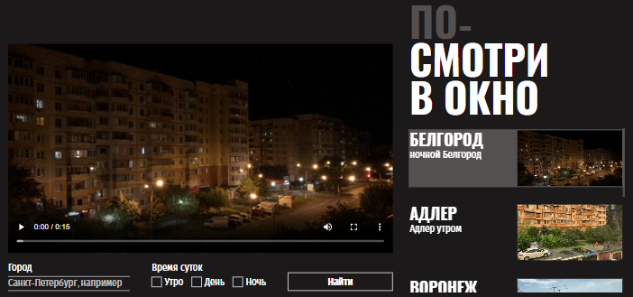

# Видеоплеер «Посмотри в окно»

Одностраничное приложение «Посмотри в окно» - видеоплеер с поиском, отображает подборку роликов и позволяет переключаться между ними. При поиске видео приложение запрашивает новые данные, заменяя текущую подборку, и отображает индикаторы загрузки или ошибок.

Данный проект нацелен на получение опыта в верстке веб-страниц, с акцентом на позиционировании элементов, использовании псевдоклассов и псевдоэлементов, а также создании стилизованных форм. Также в фокусе внимания лежит интерактивность элементов верстки - состояния кнопок и ссылок.

[Сайт на github-pages](https://anna-kobis.github.io/posmotri-v-okno/) | [Макет в Figma](https://www.figma.com/design/QHcvX1RsUI89CulRB7HLk6/)

## Стек технологий

- Верстка на HTML5 и CSS3.
- Скрипты на JavaScript (ES6+).
